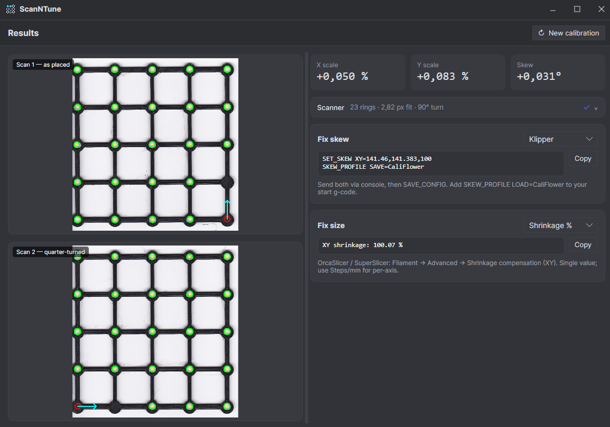
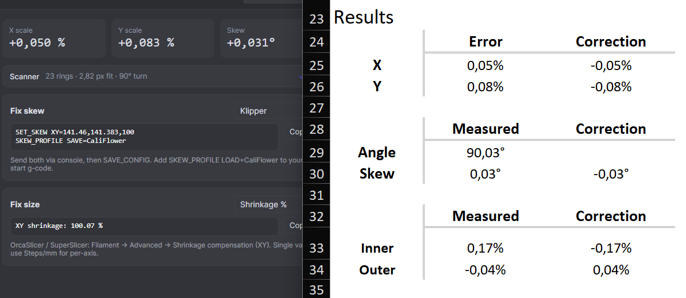

# ScanNTune

A Windows tool that calibrates a 3D printer's XY scale and skew from a flatbed scan — no calipers.

I got tired of dimensional calibration. The usual routine is something like Vector 3D's "Califlower" — a
printed coupon and a matching calculator: print it, measure it corner to corner with calipers, measure the
diagonals for skew, type all of that into the calculator, and paste the result into your firmware. The
measuring is the annoying part. It's a
fistful of caliper reads you have to keep straight, a skew diagonal that's fiddly to catch square, and then
typing it all into a calculator without a slip. So I let a scanner do the reading instead. You print the
coupon, scan it flat, and ScanNTune reads the geometry and hands you the corrections ready to paste.



It measures **ring centres**. A ring's centre doesn't move when the walls come out fatter or thinner, so
extrusion width can't shift the scale or skew it reports. Two solid rings in the corner mark the coupon's
origin and its +X direction, so the software works out orientation on its own; it doesn't matter how the
sheet landed on the glass, rotated or flipped.

## Just as good as measuring it by hand

Here's the same printer measured two ways — ScanNTune's result (left) and Vector 3D's Califlower, its coupon
hand-measured into its calculator (right):



They land on top of each other — X within 0.05%, Y within 0.08%, skew within 0.03° — because they're both
reading the same printer's error, one by scanning ScanNTune's coupon, the other by hand-measuring
Califlower's. The difference is the effort: no fistful of caliper reads to keep straight, no diagonal to
catch square, no transcribing — and it fits all 23 ring centres at once instead of a handful of measurements.

There's one more thing the caliper can't do. A flatbed scanner has its own small anisotropy and skew, and
if you only took one scan you'd be baking the scanner's error into the printer's numbers. So ScanNTune asks
for two scans — one flat, one quarter-turned — and averages them. The scanner's error cancels out and the
printer's stays. The half-difference even tells you how far off your scanner is, as a free diagnostic.

Scale has its own catch. To report shrinkage as a real percentage the software has to know how many pixels
make a millimetre, and a scanner's stated DPI is rarely exactly what it claims. So there's a one-time
calibration: scan any plastic card — a credit, debit or loyalty card, they're all the ISO/IEC 7810 ID-1
size (85.60 × 53.98 mm, held to a tight tolerance) — and ScanNTune reads the true pixels-per-millimetre off
its edges. After that your absolute scale is anchored to a known object instead of a DPI number you're
hoping is honest. You only redo it if you change scanners.

## What it does

- Reads a printed ring-lattice coupon from a flatbed scan — no manual measuring.
- Reports X/Y scale error and skew from ring centres, so extrusion width doesn't affect the result.
- Resolves orientation automatically from the two-solid corner marker — rotation and mirror-flip are
  handled, no flip toggles to get wrong.
- Cancels the scanner's own distortion by averaging a 0° and a quarter-turned scan.
- Copies out ready-to-paste corrections for whatever you run: Klipper `SET_SKEW`, Marlin
  `XY_SKEW_FACTOR` / steps-per-mm, Orca / SuperSlicer shrinkage %, and RepRapFirmware `M556`.
- Anchors absolute scale from a one-time scan of any standard plastic card (ISO/IEC 7810 ID-1), so you
  don't have to trust the scanner's stated DPI.
- Fits robustly (Huber / IRLS) and reports an honest residual, so a genuinely warped part shows up in the
  number instead of being smoothed away.

## How you use it

1. Once per scanner: scan a plastic card so ScanNTune learns your scanner's true scale.
2. Print [`calibration_coupon.stl`](calibration_coupon.stl). Want a different size or grid? Edit
   [`calibration_coupon.scad`](calibration_coupon.scad) in OpenSCAD and export your own.
3. Lay it on the scanner and scan it flat, then give it a quarter turn and scan it again.
4. Load both scans and set the coupon's baseline size (mm).
5. Copy the snippet for your firmware or slicer and paste it in.

## Building and running

You'll need the .NET 10 SDK on Windows.

```powershell
dotnet build src\ScanNTune.slnx
dotnet run --project src\ScanNTune.App
```

## License

[MIT](LICENSE) © 2026 Jakob Eichberger
